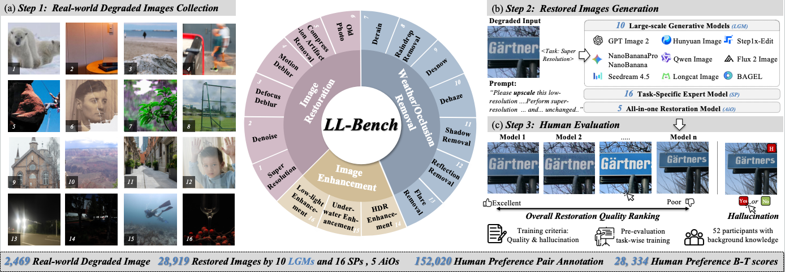
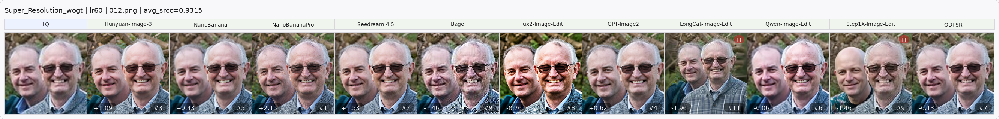
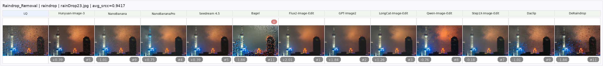
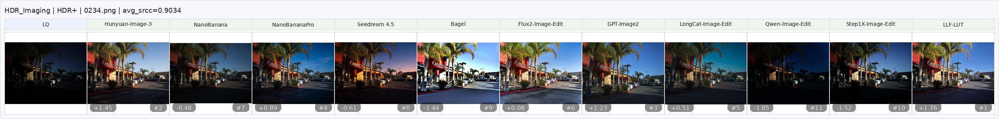
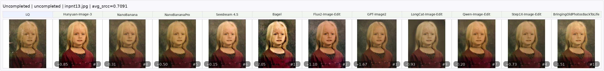
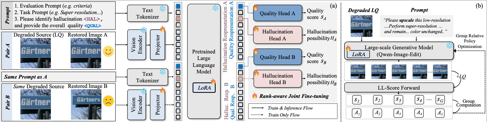

# LL-Bench: Rethinking Low-Level Vision Evaluation in the Era of Large-Scale Generative Models via Human Preferences

This is the official implementation of LL-Bench. The full dataset and code will be released upon publication. 

  

## 📦 LL-Bench Dataset

**LL-Bench** is a large-scale human-preference benchmark for low-level vision evaluation. It covers 16 low-level vision tasks.

**Image Asset**:
- <u><i>28,919</i></u> restored images (16 tasks)
- <u><i>2,469</i></u> real-world degraded source images  (16 tasks)

**Human Preference Asset**:
- <u><i>152,020</i></u> pairwise preference annotations
- <u><i>28,334</i></u> Bradley-Terry quality scores
- <u><i>28,919</i></u> hallucination labels

**Examples**:

<!-- 
<b>Super Resolution</b>

  

 -->

<b>Removal: Raindrop Removal</b>

  

<b>Enhancement: HDR Imaging</b>

  

<b>Restoration: Old Photo Restoration</b>

  

## 🧭 LL-Score

**LL-Score** is a Qwen3-VL based evaluator for low-level vision. Given a degraded
image, a restored image, and the task name, LL-Score internally wraps the task
into the evaluation instruction and jointly predicts:

- a human-preference-aligned quality score;
- a hallucination probability.

  

## ✅ To Do

-  Dataset
-  Inference Code
-  Training Code and others: release upon publication
